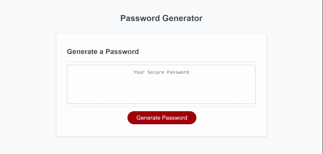
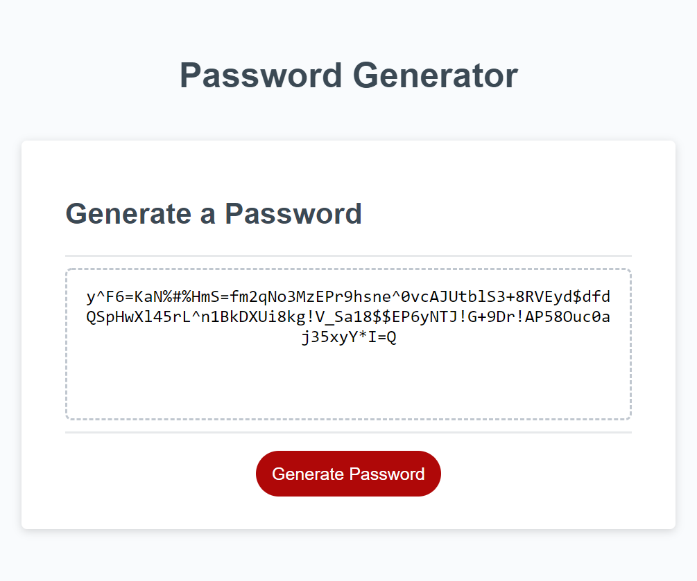

# Password Generator Starter Code
## Weekly Challenge 3: Password Generator

## Author
Disha Barua

## Link
Deployed code: https://disha2022.github.io/password-generator/

Github repository: https://github.com/Disha2022/password-generator

## User Story
AS AN employee with access to sensitive data
I WANT to randomly generate a password that meets certain criteria
SO THAT I can create a strong password that provides greater security


## Project Description
The goal of this project is to create a Password Generator using Javascript.

## Tools
1. CSS
2. HTML
3. Javascript


## index.html
1. Updated style and script references to match the new directories.

## script.js
1. Added variables for maximum and minimum length.
2. Added windows prompts for lower case, upper case, special characters and numbers.
3. Created Generate Password function 
4. Created variables to check properties required by user.
5. Created if statements to check the user input.
6. Created Windows Prompt to collect user input.
7. Added if statement as failsafe for length of the password to prevent invalid response from user.
8. Added While loop for windows prompt to allow user to correct an invalid response.

## Demo for Portfolio: Disha Barua



# Reference
## Acceptance Criteria

```
GIVEN I need a new, secure password
WHEN I click the button to generate a password
THEN I am presented with a series of prompts for password criteria

WHEN prompted for password criteria
THEN I select which criteria to include in the password
WHEN prompted for the length of the password
THEN I choose a length of at least 8 characters and no more than 128 characters
WHEN asked for character types to include in the password
THEN I confirm whether or not to include lowercase, uppercase, numeric, and/or special characters
WHEN I answer each prompt
THEN my input should be validated and at least one character type should be selected
WHEN all prompts are answered
THEN a password is generated that matches the selected criteria
WHEN the password is generated
THEN the password is either displayed in an alert or written to the page

## Review
---

You are required to submit BOTH of the following for review:

* The URL of the deployed application.

* The URL of the GitHub repository that contains your code. Give the repository a unique name and include a README file that describes the project.

- - -
© 2022 Trilogy Education Services, LLC, a 2U, Inc. brand. Confidential and Proprietary. All Rights Reserved.